# DEIDEI-CardGame 画面設計

**入口:** [index.html](./index.html)（操作プレビュー）  
要件: [アプリ要求定義](../app-requirements.md) / [ゲームルール](../game-rules.md)

---

## 操作の仕方

- 枠内（白背景）: 参加者／adminの実操作ボタン
- 枠外上部: 画面切替・デモ用遷移（本アプリのUIではない）
- 枠内下部フッタ: プレイ中ステータス

---

## 画面遷移

キャプチャ付きの遷移ボード（推奨）: **[screen-flow.html](./screen-flow.html)**  
画像: [`captures/`](./captures/)（34枚）

### 参加者メインフロー（抜粋）

TOP → 参加 → 待機 → 準備 → 給与 → 退職 → 施策 → 採用 → 手番完了 → 終了

| | | | |
|:---:|:---:|:---:|:---:|
| 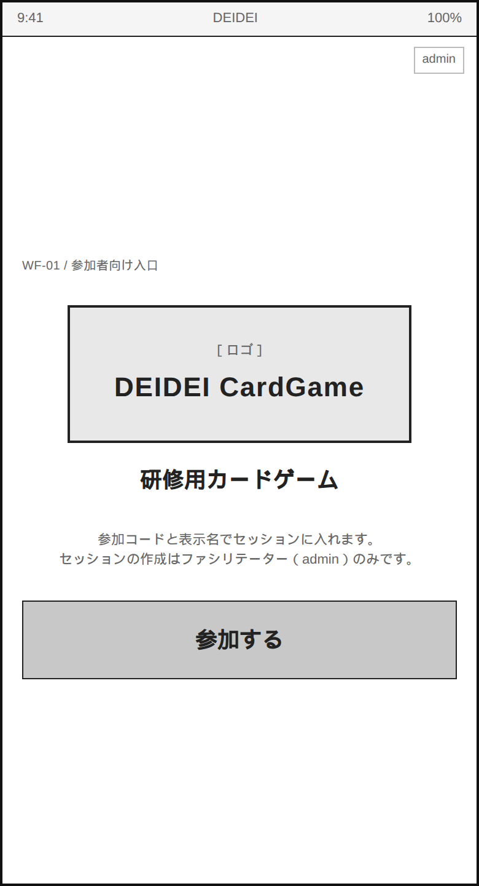 | → | 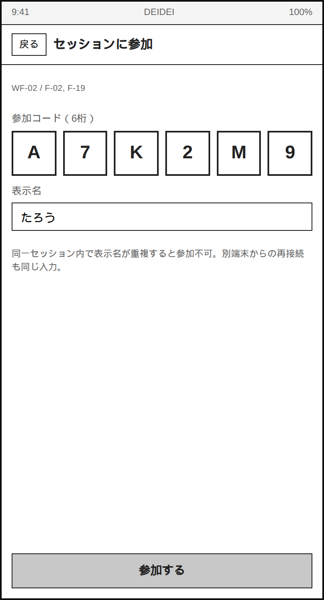 | → |
| **WF-01** TOP | | **WF-02** 参加 | |
| 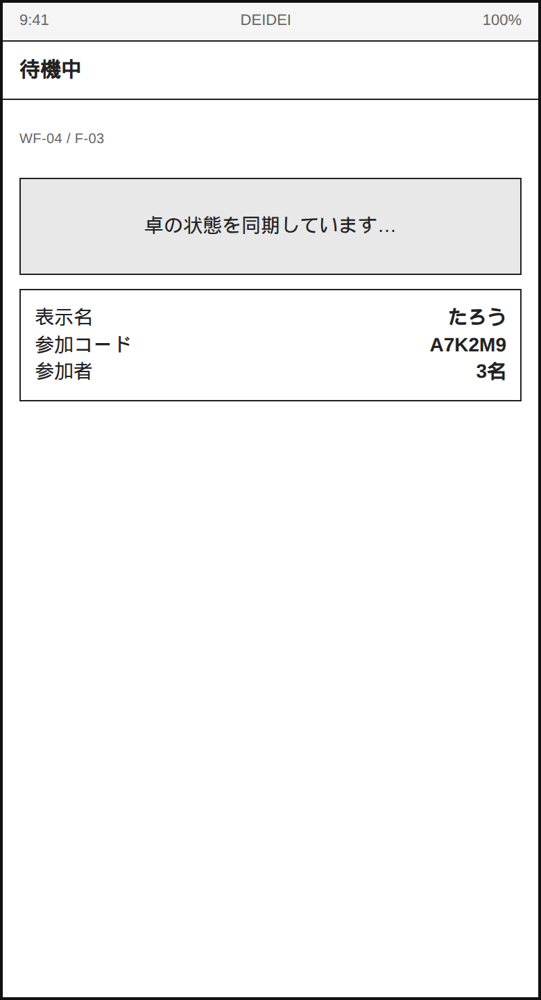 | → | 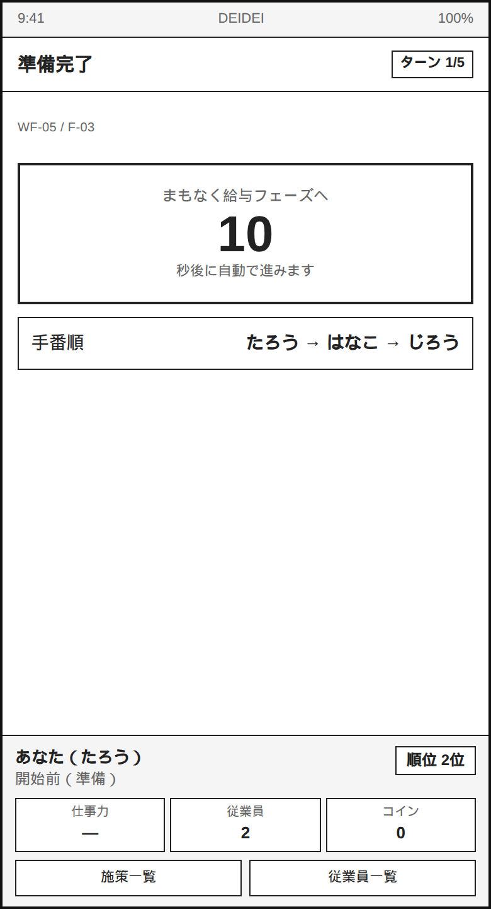 | → |
| **WF-04** 待機 | | **WF-05** 準備 | |
| 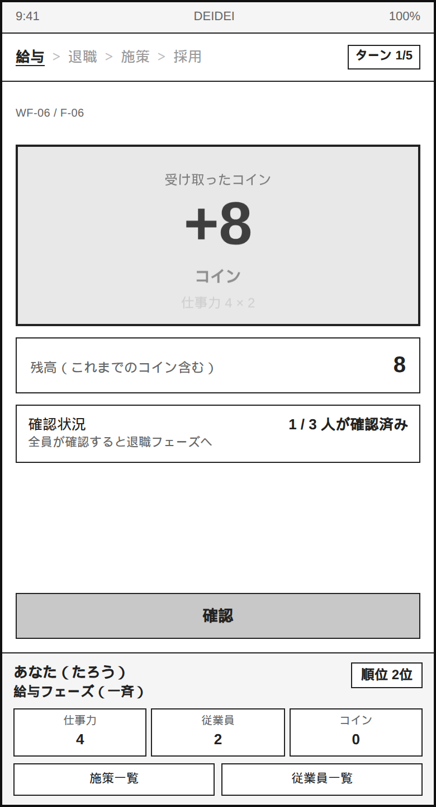 | → | 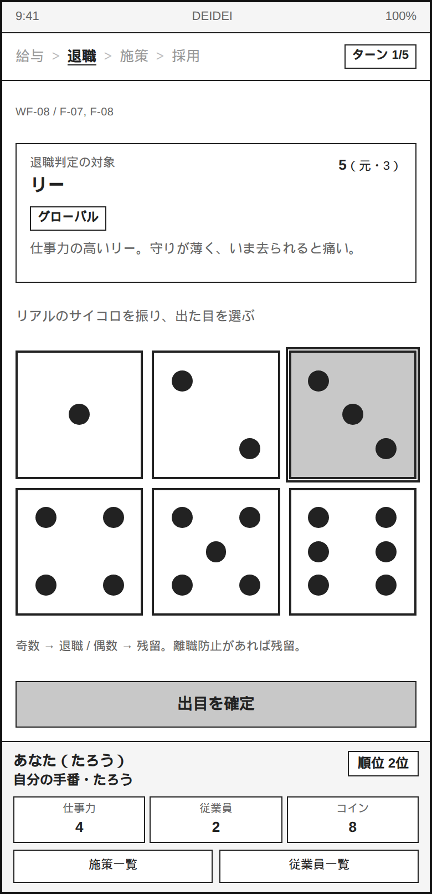 | → |
| **WF-06** 給与 | | **WF-08** 退職出目 | |
| 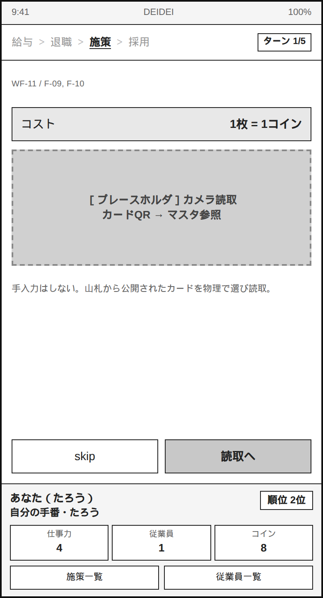 | → | 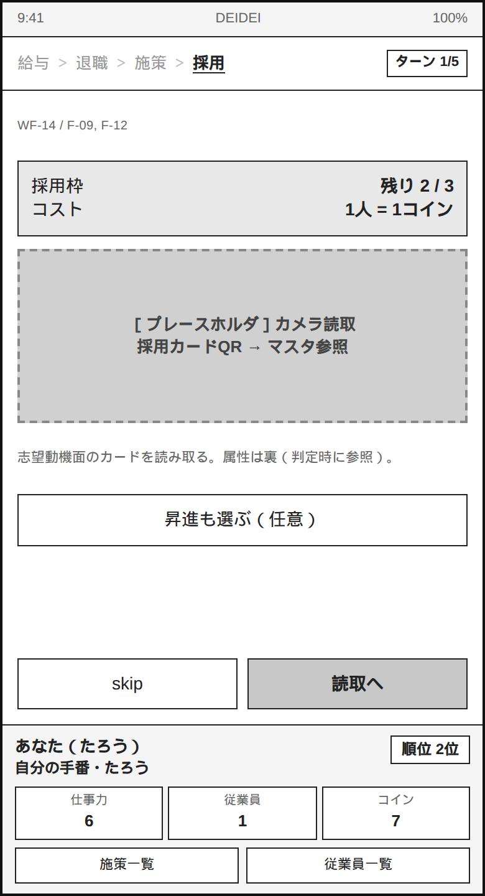 | → |
| **WF-11** 施策 | | **WF-14** 採用 | |
| 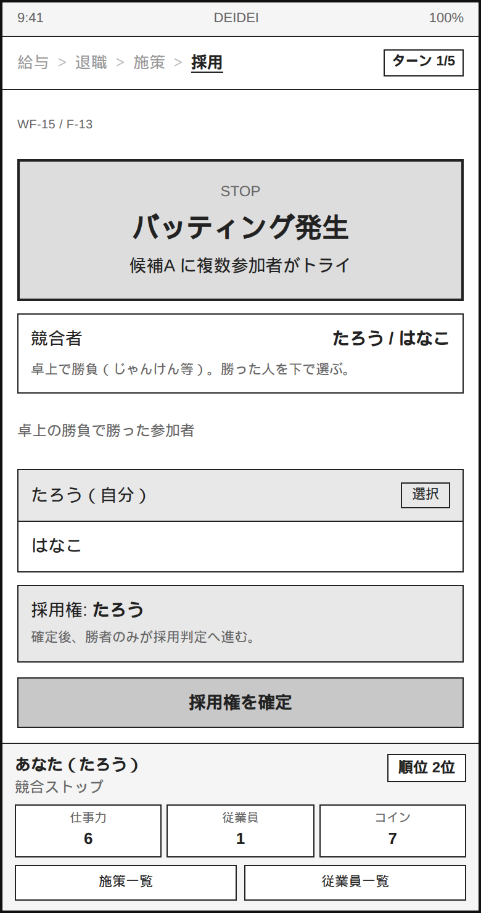 | → | 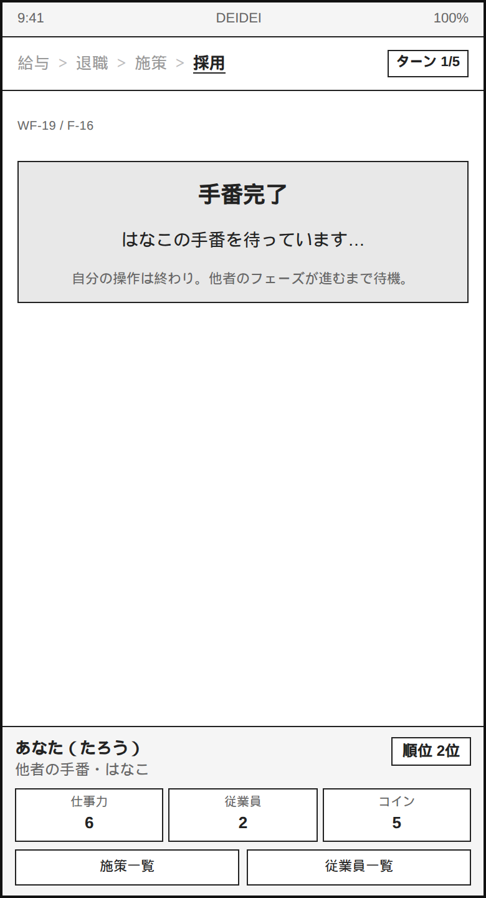 | → |
| **WF-15** バッティング | | **WF-19** 手番完了 | |
| 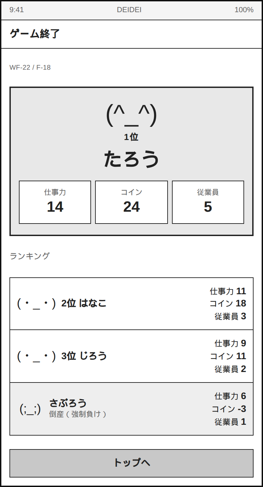 | | | |
| **WF-22** 終了 | | | |

枝（参加エラー・残留・採用失敗・昇進・一覧・再接続など）は [screen-flow.html](./screen-flow.html) を参照。

### Admin フロー（抜粋）

| | | | |
|:---:|:---:|:---:|:---:|
| 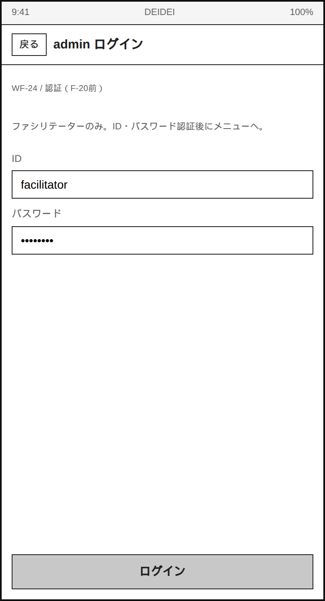 | → | 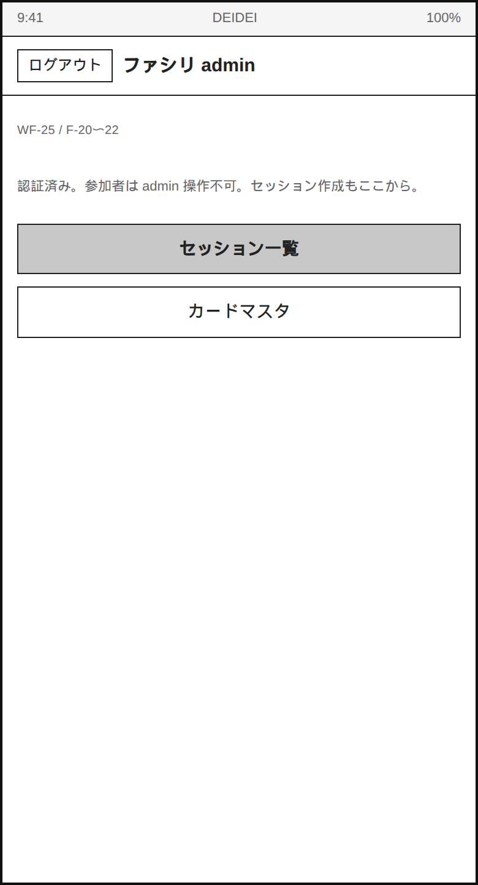 | → |
| **WF-24** ログイン | | **WF-25** メニュー | |
| 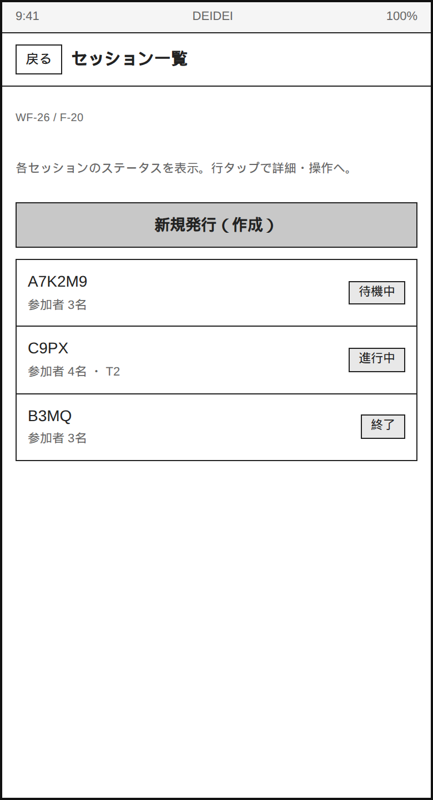 | → | 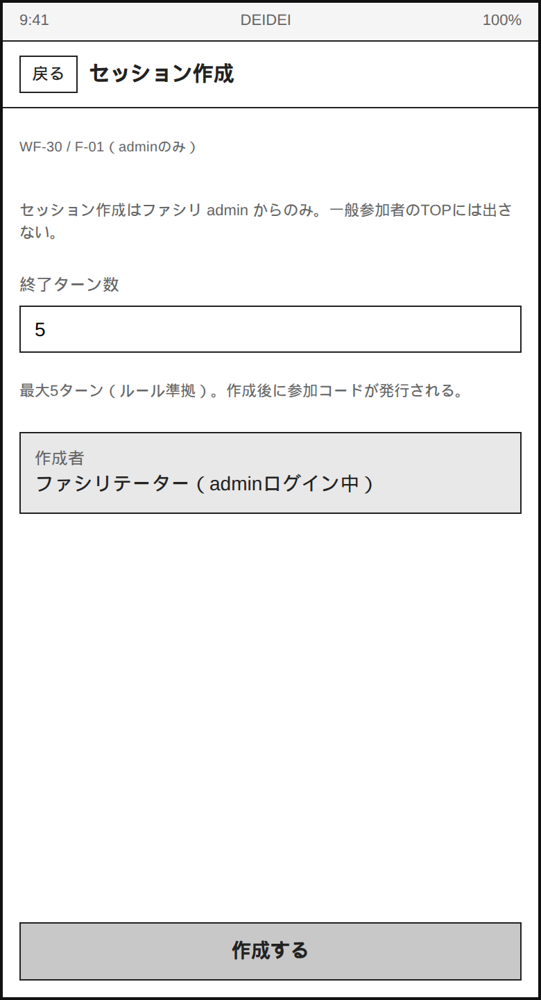 | → |
| **WF-26** セッション一覧 | | **WF-30** 作成 | |
| 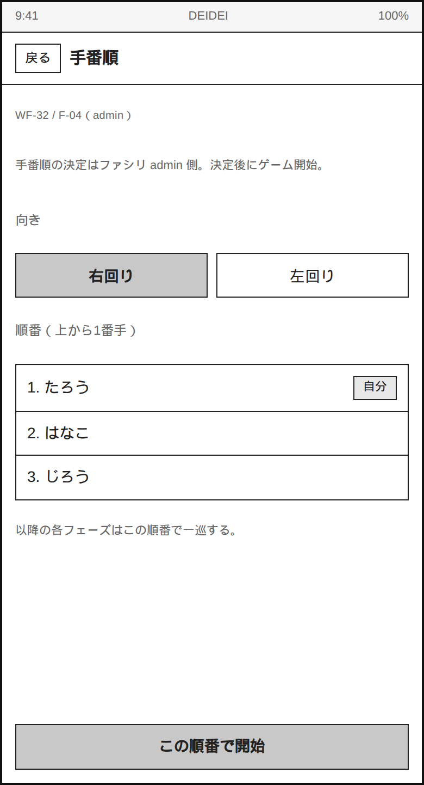 | → | 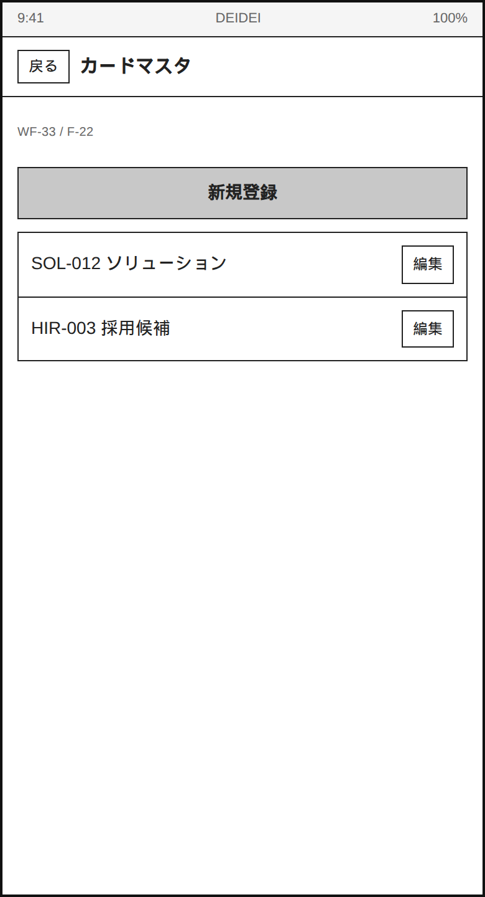 | |
| **WF-32** 手番順 | | **WF-33** カード | |

---

## 画面一覧

### 参加者（WF-01〜23）

| ID | 画面 |
|----|------|
| WF-01 | TOP（参加者向け） |
| WF-02 | 参加（コード・表示名） |
| WF-03 | 参加エラー |
| WF-04 | 待機・同期 |
| WF-05 | プレイ準備 |
| WF-06 | 給与 |
| WF-07 | 給与：全員の確認待ち |
| WF-08 | 退職：出目入力 |
| WF-09 | 退職：結果（退職） |
| WF-10 | 退職：結果（残留） |
| WF-11 | ソリューション：カード読取 |
| WF-12 | ソリューション：効果確認・演出 |
| WF-13 | ソリューション：追加で引くか |
| WF-14 | 採用：カード読取 |
| WF-15 | 採用：バッティング／勝者申告 |
| WF-16 | 採用：成功 |
| WF-17 | 採用：失敗 |
| WF-18 | 昇進（任意） |
| WF-19 | 手番完了／他者待ち |
| WF-20 | 施策一覧（属性・効果アイコン＋AI要約） |
| WF-21 | 従業員一覧（階層・仕事力・AI要約） |
| WF-22 | 終了（1位ヒーロー＋ランキング・顔文字） |
| WF-23 | 再接続 |

### ファシリ admin（WF-24〜34）

| ID | 画面 |
|----|------|
| WF-24 | admin ログイン |
| WF-25 | admin メニュー |
| WF-26 | セッション一覧（ステータス付き） |
| WF-27 | セッション詳細（待機中） |
| WF-28 | セッション詳細（進行中・取消UI） |
| WF-29 | セッション詳細（終了） |
| WF-30 | セッション作成 |
| WF-31 | 作成直後（参加コード確認） |
| WF-32 | 手番順の決定 |
| WF-33 | カードマスタ一覧 |
| WF-34 | カード登録・更新（チェック／±） |
